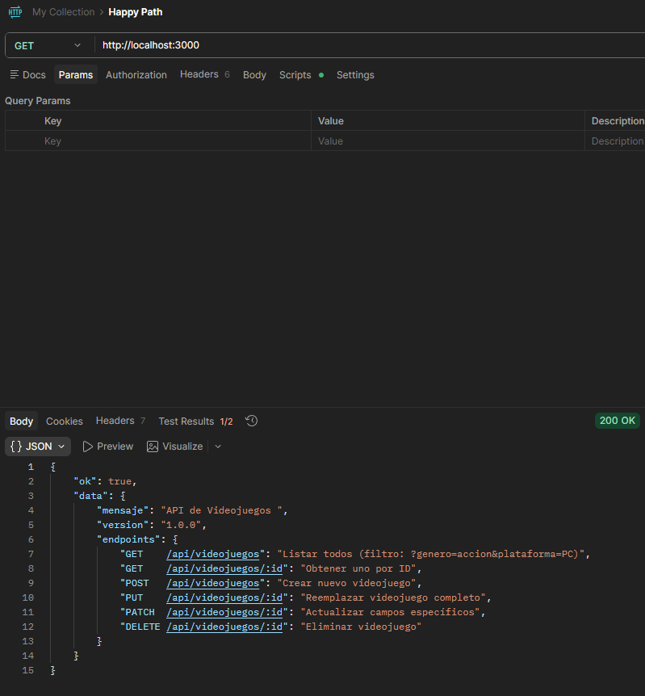
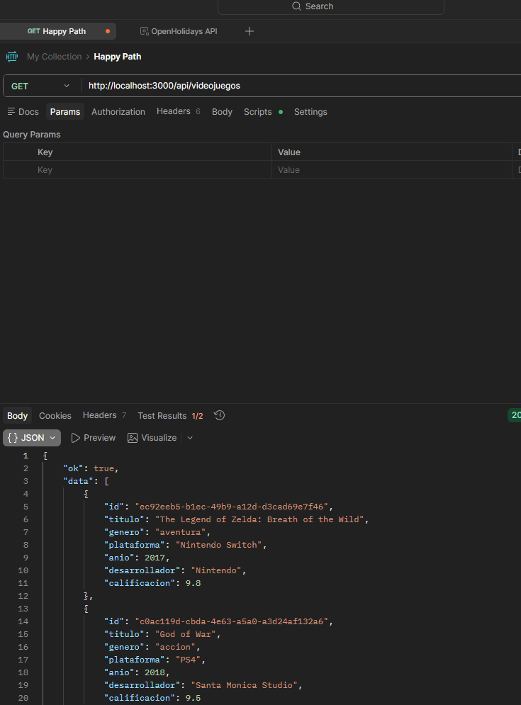
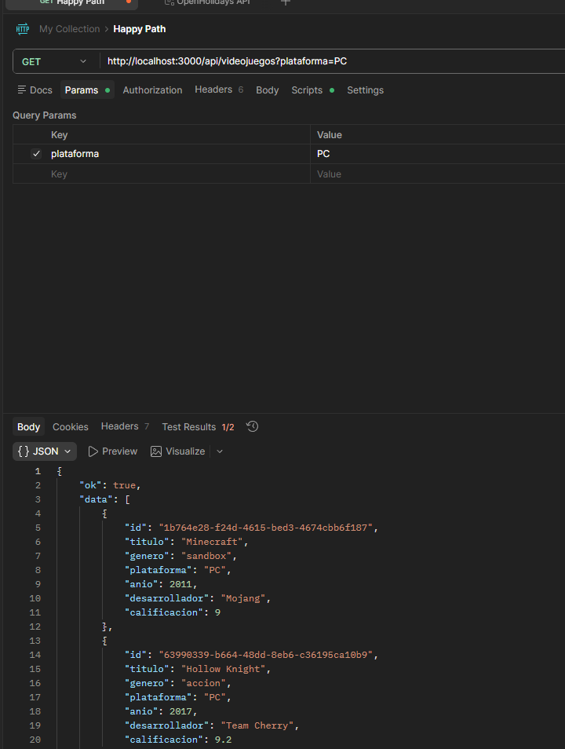
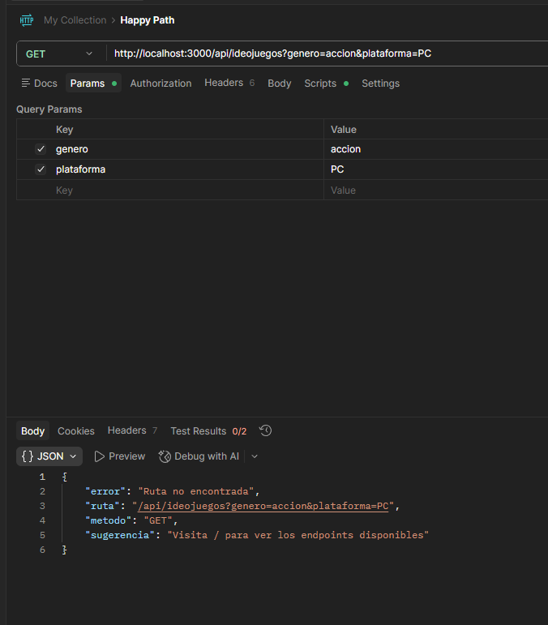
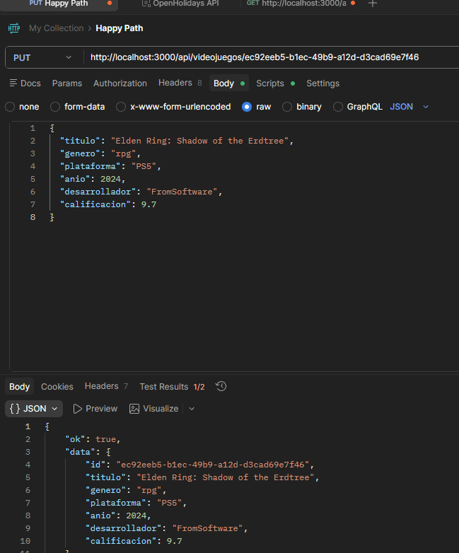
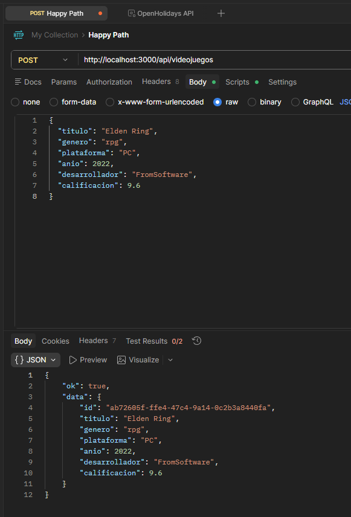
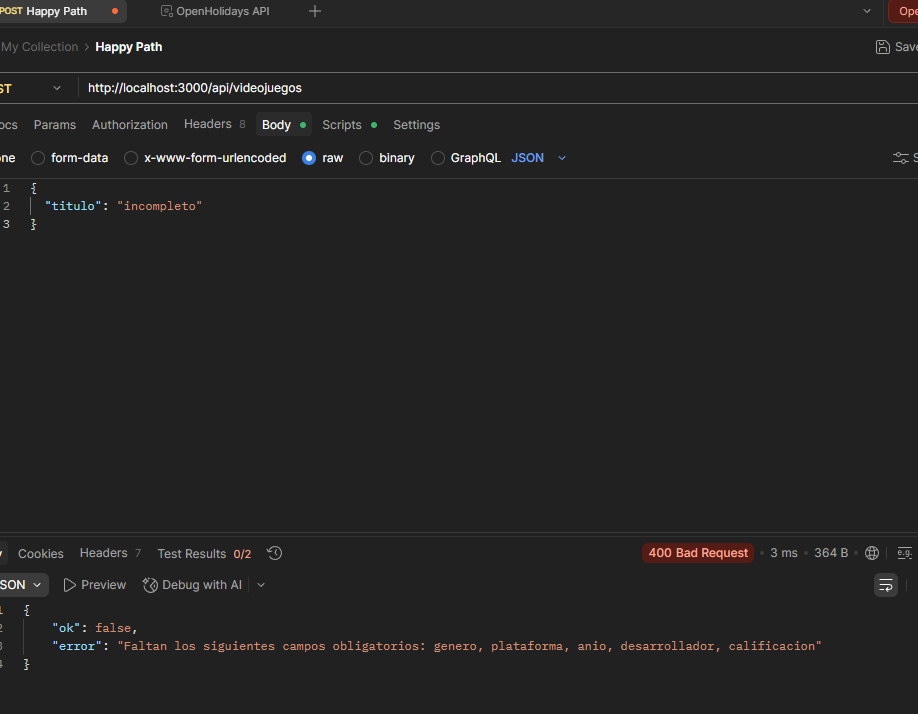
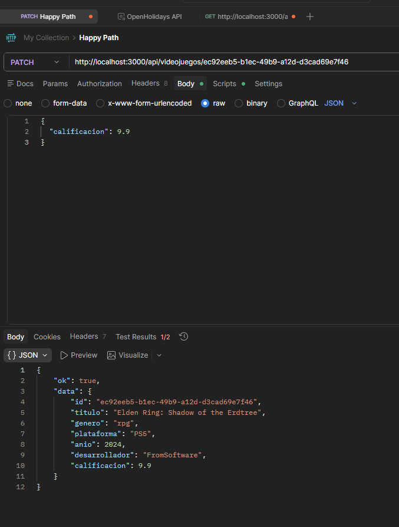
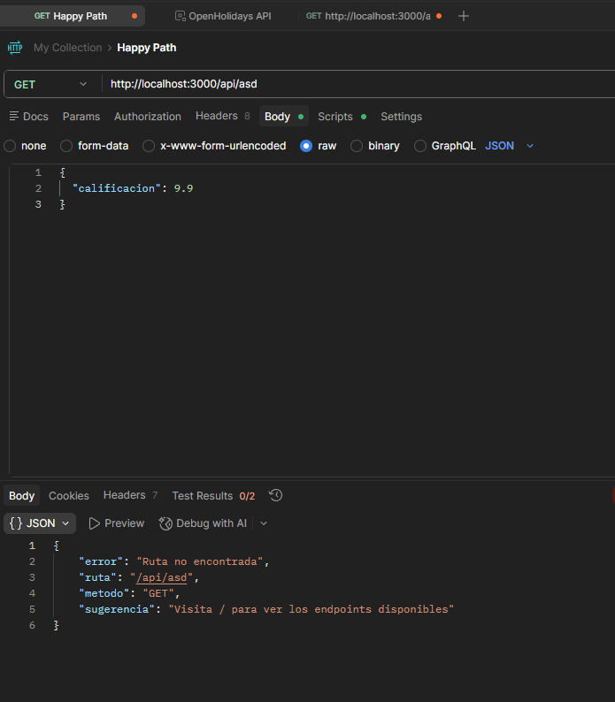

GET / — Información de la API
Método: GET
URL: http://localhost:3000/
Status: 200 OK

GET /api/videojuegos — Listar todos
Método: GET
URL: http://localhost:3000/api/videojuegos
Status: 200 OK

GET /api/videojuegos?plataforma=PC — Filtrar por plataforma
Método: GET
URL: http://localhost:3000/api/videojuegos?plataforma=PC
Status: 200 OK

GET /api/videojuegos?genero=accion&plataforma=PC — Filtrar por ambos
Método: GET
URL: http://localhost:3000/api/videojuegos?genero=accion&plataforma=PC
Status: 200 OK

GET /api/videojuegos/:id — Obtener uno por ID
Método: GET
URL: http://localhost:3000/api/videojuegos/:id
Status: 200 OK

POST /api/videojuegos — Crear nuevo (exitoso)
Método: POST
URL: http://localhost:3000/api/videojuegos
Status: 201 Created
Body enviado:

json{
  "titulo": "Elden Ring",
  "genero": "rpg",
  "plataforma": "PC",
  "anio": 2022,
  "desarrollador": "FromSoftware",
  "calificacio}

  POST /api/videojuegos — Validación fallida
Método: POST
URL: http://localhost:3000/api/videojuegos
Status: 400 Bad Request
Body enviado:
json{
  "titulo": "Juego incompleto"
}

PUT /api/videojuegos/:id — Reemplazar 
Método: PUT
URL: http://localhost:3000/api/videojuegos/:id
Status: 200 OK
Body enviado:
json{
  "calificacion": 9.9
}

PATCH /api/videojuegos/:id — Actualizar parcialmente
Método: PATCH
URL: http://localhost:3000/api/videojuegos/:id
Status: 200 OK
Body enviado:
json{
  "calificacion": 9.9
}
